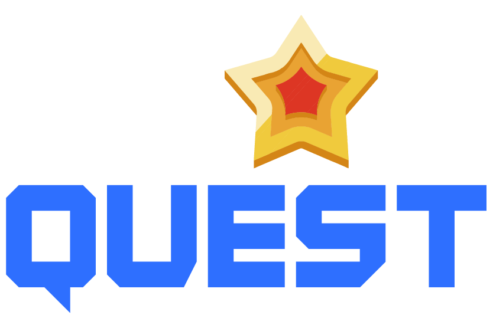

# StarQuest Frontend

<div align="center">



**Professional Gamified Learning Management System**

[](https://www.typescriptlang.org/)
[](https://reactjs.org/)
[](https://vitejs.dev/)
[](https://tailwindcss.com/)
[](LICENSE)

</div>

## 📖 Overview

StarQuest is a comprehensive gamified learning management platform designed for educational institutions, mentoring programs, and professional development initiatives. The platform transforms traditional learning experiences into engaging, quest-based journeys with robust tracking, reporting, and analytics capabilities.

**Target Audience:**
- Educational institutions and training organizations
- Corporate learning and development teams
- Mentoring and coaching programs
- Professional development initiatives

**Key Value Propositions:**
- Gamified learning experiences with quests, achievements, and leaderboards
- Comprehensive progress tracking and analytics
- Multi-role support (Admin, Mentor, Mentee)
- Real-time collaboration and workspace management
- Professional reporting and assessment tools

## 🧰 Tech Stack

### **Core Framework**
- **React 18.2+** - Modern React with hooks and concurrent features
- **TypeScript 5.2+** - Strict type safety and enhanced developer experience
- **Vite 5.1+** - Lightning-fast development and optimized production builds

### **UI & Styling**
- **Tailwind CSS 3.4+** - Utility-first CSS framework with custom gaming design system
- **Radix UI** - Accessible, unstyled component primitives
- **Lucide React** - Consistent icon library (320+ icons)
- **Framer Motion** - Smooth animations and transitions
- **Class Variance Authority** - Type-safe component variants
- **Sonner** - Toast notifications

### **State Management**
- **TanStack Query v5** - Server state management, caching, and synchronization
- **Zustand** - Lightweight client-side state management with persistence
- **React Hook Form** - Performant form handling with validation

### **Data & Validation**
- **Zod** - Schema validation and type inference
- **Axios** - HTTP client with interceptors and error handling
- **Date-fns** - Modern date utility library

### **Development & Testing**
- **Vitest** - Fast unit testing framework with coverage reporting
- **Playwright** - End-to-end testing across browsers (Chrome, Firefox, Safari, Mobile)
- **Testing Library** - Component testing utilities
- **MSW** - API mocking for development and testing
- **ESLint + Prettier** - Code linting and formatting

## 🧠 Architecture

StarQuest follows a **feature-based architecture** with clear separation of concerns and modern React patterns:

### **Design Patterns**
- **Service Layer Pattern** - Centralized API communication through service classes
- **Singleton Pattern** - Service instances with `getInstance()` methods
- **Custom Hooks Pattern** - Reusable business logic and state management
- **Compound Components** - Flexible, composable UI components
- **Error Boundary Pattern** - Graceful error handling and recovery

### **Key Architectural Decisions**
- **BaseApiService** - Abstract class providing consistent API interaction patterns
- **Interceptor Pattern** - Automatic JWT token handling and 401 redirects
- **Type-First Development** - Comprehensive TypeScript interfaces and Zod schemas
- **Modular Component System** - Feature-based component organization
- **Professional Environment Config** - Automatic `/api` suffix handling

### **State Management Strategy**
- **Server State** - TanStack Query for API data, caching, and synchronization
- **Client State** - Zustand for UI state and user preferences
- **Form State** - React Hook Form with Zod validation
- **Authentication State** - Persistent auth store with automatic session validation

## 🧩 Main Features

### **🔐 Authentication & Authorization**
- JWT-based authentication with HTTP-only cookies
- Role-based access control (Admin, Mentor, Mentee)
- Protected routes with redirect handling
- Session persistence and automatic validation
- Invitation-based workspace onboarding

### **📊 Comprehensive Reporting System**
- **Daily Reports** - Progress tracking, mood assessment, and goal setting
- **Weekly Reports** - Performance summaries and reflection
- **End-of-Day Reports** - Task completion and achievement tracking
- **Analytics Dashboard** - Visual insights with charts and trends
- **Report History** - Comprehensive tracking and export capabilities

### **🎮 Gamification System**
- **Quest-based Learning** - Structured learning paths with milestones
- **Achievement System** - Performance tracking and rewards
- **Leaderboards** - Competitive rankings with workspace filtering
- **Progress Tracking** - Visual progress indicators and completion rates
- **Star System** - Point-based achievement tracking

### **👥 Workspace Management**
- **Multi-workspace Support** - Organize users across different programs
- **Team Collaboration** - Shared quests and group activities
- **Email Invitation System** - Streamlined user onboarding
- **Position Management** - Flexible role and responsibility assignment
- **Admin Analytics** - Comprehensive workspace insights

### **📱 Responsive Design**
- **Mobile-First Approach** - Optimized for all device sizes (320px+)
- **Adaptive Sidebar** - Collapsible navigation with overlay on mobile
- **Touch-Friendly** - Optimized interactions for mobile devices
- **Progressive Enhancement** - Graceful degradation across browsers

## 📂 Folder Structure

```
src/
├── components/           # Reusable UI components
│   ├── admin/           # Admin-specific components (12 components)
│   │   ├── AdminDashboard.tsx
│   │   ├── UserManagement.tsx
│   │   ├── TaskManagement.tsx
│   │   ├── ReportsManagement.tsx
│   │   └── ...
│   ├── auth/            # Authentication components
│   │   ├── AuthLayout.tsx
│   │   ├── PrivateRoute.tsx
│   │   └── index.ts
│   ├── common/          # Shared utility components
│   │   ├── ErrorBoundary.tsx
│   │   └── ApiErrorHandler.tsx
│   ├── Dashboard/       # Dashboard-specific components
│   │   ├── PerformanceDashboard.tsx
│   │   ├── LearningRoadmap.tsx
│   │   ├── QuestBoard.tsx
│   │   └── UserStats.tsx
│   ├── debug/           # Development debug tools
│   │   └── EnvironmentDebug.tsx
│   ├── reports/         # Reporting components
│   │   ├── forms/       # Report form components
│   │   ├── shared/      # Shared report components
│   │   └── ReportSubmissionModal.tsx
│   └── ui/              # Base UI components (Radix-based)
│       ├── button.tsx   # Gaming-themed button variants
│       ├── card.tsx     # Responsive card components
│       ├── sidebar.tsx  # Adaptive navigation
│       └── ...
├── config/              # Application configuration
│   ├── axiosInstance.tsx # Configured Axios with interceptors
│   └── environment.ts   # Professional environment handling
├── hooks/               # Custom React hooks
│   ├── useAdmin.ts      # Admin operations (20+ hooks)
│   ├── useReports.ts    # Report management
│   ├── useQuests.ts     # Quest operations
│   ├── useLeaderboard.ts # Leaderboard data
│   └── useCurrentWorkspace.ts
├── pages/               # Page components
│   ├── auth/            # Authentication pages (7 pages)
│   │   ├── Login.tsx
│   │   ├── Register.tsx
│   │   ├── AcceptInvitation.tsx
│   │   └── ...
│   └── public/          # Main application pages (8 pages)
│       ├── UserDashboard.tsx
│       ├── AdminDashboard.tsx
│       ├── DailyReports.tsx
│       └── ...
├── routes/              # Routing configuration
│   ├── index.tsx        # Main router with protected routes
│   ├── paths.tsx        # Route constants
│   └── elements.tsx     # Route components
├── schemas/             # Zod validation schemas
│   ├── auth.schemas.ts
│   ├── reports.schemas.ts
│   ├── quest.schemas.ts
│   └── ...
├── services/            # API service layer
│   └── api/
│       ├── base.ts      # Abstract BaseApiService
│       ├── auth.ts      # Authentication services
│       ├── admin.ts     # Admin operations (990+ lines)
│       ├── reports.ts   # Report services
│       ├── quest.ts     # Quest management
│       └── ...
├── store/               # Zustand state management
│   ├── auth.ts          # Authentication state (persistent)
│   ├── reports.ts       # Reports state
│   ├── ui.ts            # UI state (sidebar, theme)
│   └── index.ts
├── types/               # TypeScript definitions
│   ├── User.ts          # User and role types
│   ├── Report.ts        # Report interfaces
│   ├── Quest.ts         # Quest and task types
│   ├── Auth.ts          # Authentication types
│   └── ...
├── utils/               # Utility functions
│   ├── dateUtils.ts     # Date formatting and manipulation
│   ├── errorUtils.ts    # Error handling utilities
│   ├── imageUtils.ts    # Image processing and responsive utilities
│   └── validationUtils.ts
├── Layout/              # Layout components
│   └── Layout.tsx       # Main app layout with responsive sidebar
├── lib/                 # Shared utilities
│   └── utils.ts         # Tailwind utility functions
├── App.tsx              # Root application component
├── main.tsx             # Application entry point
└── index.css            # Global styles with custom gaming theme
```

## 🚀 Getting Started

### **Prerequisites**
- **Node.js** 18.0+ or 20.0+
- **pnpm** 8.0+ (recommended package manager)

### **Installation**

```bash
# Clone the repository
git clone https://github.com/your-org/starquest-frontend.git
cd starquest-frontend

# Install dependencies
pnpm install

# Start development server
pnpm dev
```

### **Environment Setup**

Create a `.env.local` file in the project root:

```env
# API Configuration - CRITICAL: Must include /api suffix
VITE_API_BASE_URL=https://api.starquest.app/api

# For local development with backend
# VITE_API_BASE_URL=http://localhost:3000/api
```

### **Available Scripts**

```bash
# Development
pnpm dev              # Start development server (http://localhost:5173)
pnpm preview          # Preview production build locally

# Building
pnpm build            # Production build with type checking
pnpm build:analyze    # Build with bundle analysis
pnpm build:prod       # Build with explicit environment variables

# Code Quality
pnpm lint             # Run ESLint with TypeScript
pnpm lint:fix         # Fix ESLint issues automatically
pnpm format           # Format code with Prettier
pnpm type-check       # TypeScript type checking

# Testing
pnpm test             # Run unit tests with Vitest
pnpm test:ui          # Run tests with Vitest UI
pnpm test:coverage    # Generate coverage report (80% threshold)
pnpm test:e2e         # Run Playwright E2E tests
pnpm test:all         # Run all test suites
pnpm test:accessibility # Run pa11y accessibility tests
```

## ⚙️ Production Deployment

### **Environment Variables**
For production deployment (Vercel, Netlify, etc.), set:

```env
VITE_API_BASE_URL=https://api.starquest.app/api
```

### **Build Optimization Features**
- **Code Splitting** - Vendor, UI, forms, and animation chunks
- **Asset Optimization** - Image compression and responsive handling
- **CSS Minification** - Tailwind CSS purging and optimization
- **Bundle Analysis** - Size warnings and optimization recommendations
- **Performance** - Lazy loading and caching strategies

### **Production Checklist**
- ✅ Set `VITE_API_BASE_URL` environment variable
- ✅ HTTPS enabled for secure cookie handling
- ✅ Error monitoring configured
- ✅ CDN setup for static assets
- ✅ Health checks and monitoring

### **Deployment Configuration**
The application is optimized for major platforms:

**Vercel:**
```json
{
  "buildCommand": "pnpm build",
  "outputDirectory": "dist",
  "installCommand": "pnpm install"
}
```

**Netlify:**
```toml
[build]
  command = "pnpm build"
  publish = "dist"
```

## 🧪 Testing

### **Testing Stack**
- **Vitest** - Unit and integration testing with 80% coverage threshold
- **Playwright** - Cross-browser E2E testing (Desktop + Mobile)
- **Testing Library** - React component testing utilities
- **MSW** - API mocking and service worker testing
- **pa11y-ci** - Automated accessibility testing

### **Test Configuration**
```typescript
// Coverage thresholds (vitest.config.ts)
coverage: {
  thresholds: {
    global: {
      branches: 80,
      functions: 80,
      lines: 80,
      statements: 80
    }
  }
}

// Cross-browser testing (playwright.config.ts)
projects: [
  'Desktop Chrome', 'Desktop Firefox', 'Desktop Safari',
  'Mobile Chrome (Pixel 5)', 'Mobile Safari (iPhone 12)'
]
```

### **Current Status**
- ✅ Testing infrastructure fully configured
- ✅ Coverage thresholds set to professional standards
- ✅ Multi-browser E2E testing ready
- ✅ API mocking with MSW configured
- ⚠️ Test implementation in progress

## ♿ Accessibility

StarQuest prioritizes accessibility with WCAG 2.1 AA compliance:

### **Accessibility Features**
- **Radix UI Foundation** - ARIA-compliant, keyboard navigable components
- **Semantic HTML** - Proper heading hierarchy and landmark elements
- **Focus Management** - High-contrast focus indicators and logical tab order
- **Screen Reader Support** - Comprehensive ARIA labels and descriptions
- **Color Contrast** - Gaming theme with accessible color ratios
- **Responsive Text** - Scalable typography supporting 200% zoom

### **Keyboard Navigation**
- Full keyboard support for all interactive elements
- Custom focus styles with gaming theme integration
- Skip links for efficient navigation
- Logical tab order throughout the application

### **Testing Tools**
- **pa11y-ci** - Automated accessibility testing in CI/CD
- **axe-core** - Development-time accessibility validation
- **Manual testing** protocols for screen readers

## 🎨 Design System

### **Gaming Theme**
- **Color Palette** - Professional gaming colors with accessibility compliance
- **Typography** - Inter font with optimized rendering
- **Animations** - Smooth transitions with `framer-motion`
- **Components** - Consistent design language across all features

### **Responsive Breakpoints**
```css
xs: 320px   /* Mobile devices */
sm: 640px   /* Large mobile */
md: 768px   /* Tablets */
lg: 1024px  /* Desktop */
xl: 1280px  /* Large desktop */
2xl: 1536px /* Ultra wide */
```

## 📄 License

This project is licensed under the MIT License - see the [LICENSE](LICENSE) file for details.

## 🔗 Related Repositories

- **[StarQuest Backend](https://github.com/your-org/starquest-backend)** - Node.js/Express API server with MongoDB
- **[StarQuest Documentation](https://github.com/your-org/starquest-docs)** - Comprehensive project documentation

## 🤝 Contributing

We welcome contributions! Please ensure:

1. **Code Quality** - Follow ESLint and Prettier configurations
2. **Type Safety** - Maintain strict TypeScript compliance
3. **Testing** - Add tests for new features
4. **Documentation** - Update README and inline documentation
5. **Accessibility** - Ensure WCAG 2.1 AA compliance

### **Development Workflow**
```bash
# 1. Fork and clone
git clone https://github.com/your-username/starquest-frontend.git

# 2. Install dependencies
pnpm install

# 3. Create feature branch
git checkout -b feature/amazing-feature

# 4. Make changes and test
pnpm test:all

# 5. Commit and push
git commit -m "feat: add amazing feature"
git push origin feature/amazing-feature
```

## 📞 Support

- **Issues** - [GitHub Issues](https://github.com/your-org/starquest-frontend/issues)
- **Discussions** - [GitHub Discussions](https://github.com/your-org/starquest-frontend/discussions)
- **Documentation** - [docs.starquest.app](https://docs.starquest.app)

---

<div align="center">

**Built with ❤️ for modern learning experiences**

[Website](https://starquest.app) • [API](https://api.starquest.app) • [Documentation](https://docs.starquest.app)

</div>
